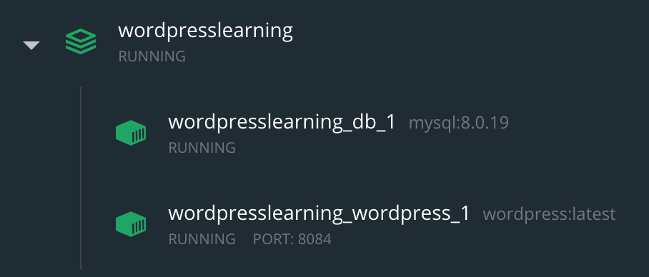

# ABOUT this repository

BACKGROUND: There are 2 ways to install Wordpress using docker:

- Execute the following command:
` docker pull wordpress `

or 

- Using a docker-compose file, which is the procedure we use for this repo.

## I'm in a hurry, how to use this repo
- Clone ` git@github.com:luisSilvaBase22/wordpress-sample-theme-and-plugins.git ` 
- Open a Terminal and navigate to the folder where you had clone the repo
- Run this command ` docker-compose up `
- Open a browser and navigate to http://localhost:8084/
- Configure your WP environment as follow
    1. Pick up a language 
    2. Use any user, any password and any email you want 
    3. The registration was done successfully 
    4. Use the user and password defined in step 2 

## Basic docker commands
NOTE if there are more than one development environment running, the following commands will affect them all
- Start environment ` docker-compose up `
- Shut down environment ` docker-compose down `
- You can always use Ctrl C to stop the process though

The following commands can be used when switching among branches to apply cleaner changes but warning, the inconvenient is that images and documents uploaded in the environment will disappear

- Clean volumes ` docker volume prune `
- Clean containers ` docker container prune `
- See more instructions ` docker-compose h `

## This repo contains:

- A Docker image with a Wordpress environment ready to be deployed
- The environment is set using a docker compose file which contains 2 main services:
    * MySQL database
    * Wordpress
The Wordpress service is dependent from the MySQL DataBase and such dependency is explicitly  set in the docker compose file.

Inside the docker file you will find comments about what does each line of code

## How to install docker initially (this step is not necessary if you clone this repo)

 * Create an empty docker-compose.yml file inside the folder
   ** IN case an error related to the 80 port indicating it is already in use, just change port number in the line 22 to 8086, 8088 or another available
   ** The folder /etc along with all of its content must be created explicitly 
 * ONCE the docker compose file is set and the etc folder is created, execute in terminal the following line: `docker-compose up -d`
 * After executing the previous command, you should see indicated in the terminal or in the Docker dashboard the 2 volumes as done (Terminal) or in green color (Dasdboard) 
 * Finally, open your browser and visit the following URL: localhost:80 to the Wordpress app running

##### Reference
* [Docker image](https://hub.docker.com/_/wordpress)
* [Sample docker file](https://github.com/docker/awesome-compose/blob/master/wordpress-mysql/docker-compose.yaml)
* [Video used as reference](https://www.youtube.com/watch?v=pYhLEV-sRpY)